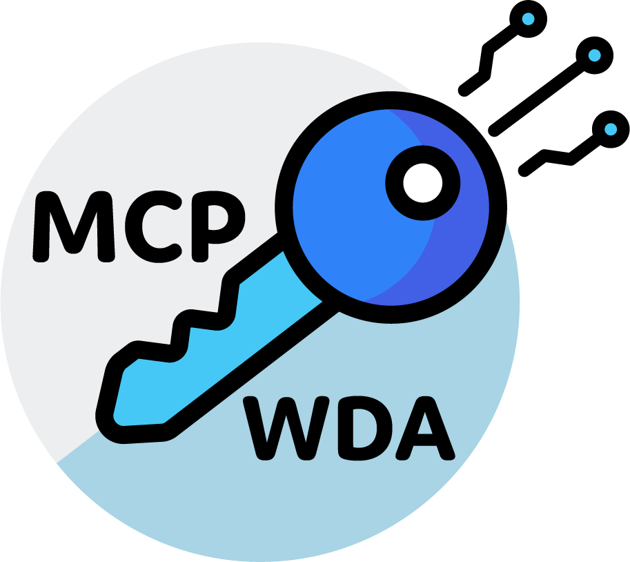

# WebDriverAgent MCP Server

<h1 align="center">
	<br>
	
	<br>
	<br>
	<br>
</h1>

This is a Model Context Protocol (MCP) server that provides tools for building and signing WebDriverAgent for iOS.

## Overview

The WebDriverAgent MCP Server exposes functionality to:

1. Build WebDriverAgent using Xcode
2. Package it into an IPA file
3. Sign the IPA with a mobile provisioning profile

This server is particularly useful for automating the process of preparing WebDriverAgent for use with Appium on iOS devices.

## Installation

1. Clone this repository
2. Install dependencies:

```bash
npm install
```

3. Build the project:

```bash
npm run build
```

## Configuration

To use this MCP server with Claude, you need to add it to your MCP settings configuration file. The location of this file depends on your platform:

- For Cursor: `/Users/[username]/Library/Application Support/Cursor/User/globalStorage/saoudrizwan.claude-dev/settings/cline_mcp_settings.json`
- For Claude Desktop: `/Users/[username]/Library/Application Support/Claude/claude_desktop_config.json`

Add the following configuration to the `mcpServers` object in the settings file:

```json
{
  "mcpServers": {
    "wda-mcp-server": {
      "command": "node",
      "args": ["/path/to/wda-mcp/build/index.js"],
      "env": {},
      "disabled": false,
      "autoApprove": []
    }
  }
}
```

Replace `/path/to/wda-mcp` with the actual path to this project.

## Available Tools

### build_and_sign_wda

This tool builds and signs WebDriverAgent for iOS.

**Parameters:**

- `mobileProvisioningFile` (optional): Path to the mobile provisioning file which is used to sign the webdriver agent
- `wdaProjectPath` (optional): Path to webdriver agent xcode project
- `isFreeAccount` (required): Whether this is a free account provisioning profile
- `bundleId` (required for free accounts): Bundle ID to use for signing

**Example Usage:**

```javascript
<use_mcp_tool>
<server_name>wda-mcp-server</server_name>
<tool_name>build_and_sign_wda</tool_name>
<arguments>
{
  "isFreeAccount": true,
  "bundleId": "com.example.WebDriverAgentRunner",
  "wdaProjectPath": "/path/to/WebDriverAgent"
}
</arguments>
</use_mcp_tool>
```

## Requirements

- macOS with Xcode installed
- Node.js 14 or higher
- Valid iOS provisioning profile for signing

## Development

To run the server in development mode with automatic recompilation:

```bash
npm run dev
```

## License

ISC
